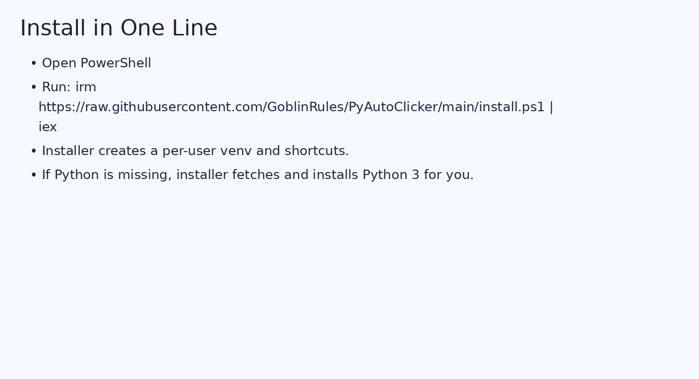
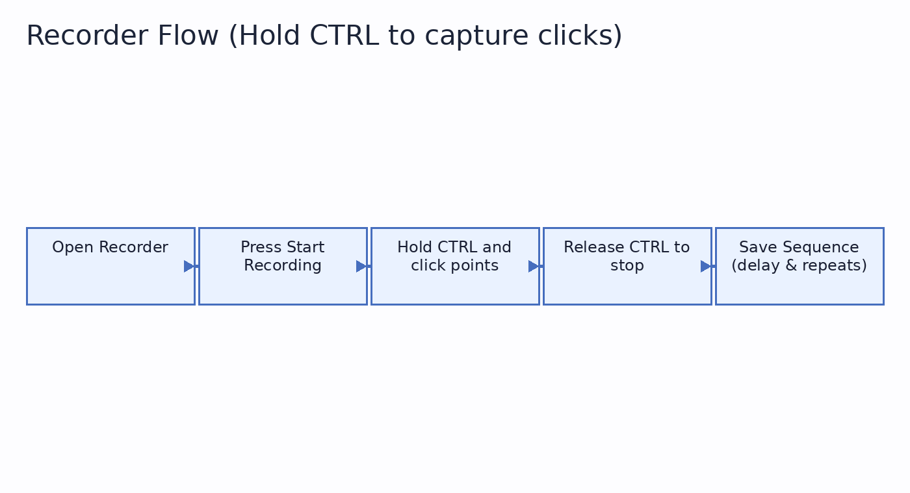
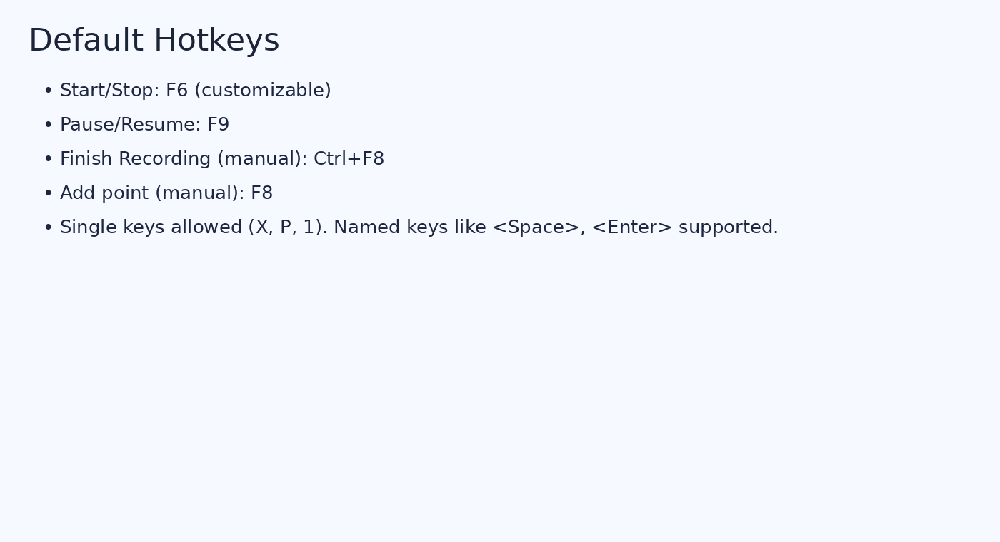
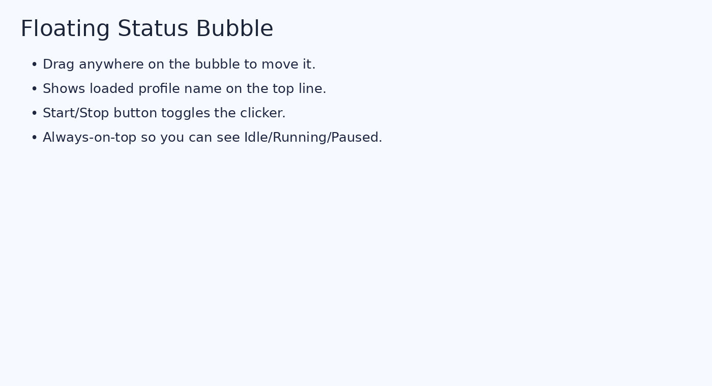

# PyAutoClicker


A lightweight, privacy‑friendly auto clicker for Windows with a built‑in **recorder**, **sequence manager**, and a draggable **status bubble**. Configure hotkeys, jitter, delays, and repeat counts — then launch in one tap.

> **License:** GPL‑3.0 — see [LICENSE](LICENSE)

---

## ✨ Features

- **CTRL‑hold recorder:** press **Start Recording**, then **hold CTRL** and click to capture points. Release **CTRL** to stop.
- **Sequence metadata:** name, site, slot, date, notes. Set **inter‑click delay (ms)** and **repeats** (0 = infinite).
- **Sequence manager:** browse, load, delete saved JSON sequences.
- **Unique saves:** never overwrites — new files are auto‑numbered.
- **Customizable hotkeys:** single keys (`x`, `p`, `1`) or combos (`Ctrl+X`, function keys).
- **Floating bubble:** draggable, always-on-top panel showing **Loaded: …** and current state (Idle/Running/Paused).
- **Human-like options:** random time jitter (±ms), pixel jitter (±px), max CPS safety, optional double-clicks.
- **Tray menu:** quick Start/Stop, Pause/Resume, open Recorder/Settings, Exit.
- **Portable install:** per-user virtual environment inside `%LOCALAPPDATA%\PyAutoClicker`.



---

## 🚀 Install (PowerShell)

> If Python isn’t installed, the installer will fetch and install it for you (per‑user).

```powershell
irm https://raw.githubusercontent.com/GoblinRules/PyAutoClicker/main/install.ps1 | iex
```

This downloads `pyautoclicker.py`, creates a virtual environment, installs dependencies (`pynput`, `pystray`, `Pillow`), and adds **Start Menu** + **Desktop** shortcuts.

- Installed to: `%LOCALAPPDATA%\PyAutoClicker`
- Run manually (no console):
  ```powershell
  Start-Process "$env:LOCALAPPDATA\PyAutoClicker\.venv\Scripts\pythonw.exe" -ArgumentList "`"$env:LOCALAPPDATA\PyAutoClicker\pyautoclicker.py`""
  ```

---

## 🧭 Quick Start

1. Open **Settings → General**, tweak **Base interval (ms)** (used only when no sequence is loaded).
2. Click **Open Recorder** (or tray → Recorder).
3. Hit **Start Recording**, then **hold CTRL** and click every spot you want.
4. **Release CTRL** to stop.
5. Click **Save Sequence…**, set **inter‑click delay (ms)**, **repeats** (0 = infinite), and add metadata.
6. Start/Stop with your hotkey (default **F6**).



---

## 🎛️ Settings Overview

- **Base interval (ms):** used when **no sequence** is loaded; clicks at the current cursor.
- **Random time jitter (±ms):** adds/subtracts up to N ms for human‑like timing.
- **Pixel jitter (±px):** random pixel drift around the target coordinate.
- **Max CPS:** safety cap on clicks per second.
- **Double-click:** perform 2 clicks per step.
- **Dark mode / Sounds / Auto‑open ‘Save Sequence’** after recording.
- **Hotkeys:** customize Start/Stop, Pause/Resume, Add point (manual), Finish recording.



---

## 🧰 Floating Status Bubble

The small always‑on‑top panel that shows:
- **Loaded:** name of the selected sequence (or `(none)`)
- **Status:** Idle / Running / Paused
- A **Start/Stop** button

Tip: **drag anywhere** on the bubble to move it.



---

## 💾 Sequences

Saved sequences are JSON files in `sequences/`. Each save **never overwrites** — a unique filename is chosen automatically.

Use **Settings → Sequences** to scroll through saved sequences, load one, delete one, or open the folder.

**JSON shape** (for reference):
```json
{
  "meta": {
    "name": "My Picks",
    "site": "example",
    "slot": "A1",
    "date": "2025-08-11",
    "notes": "Half screen layout",
    "inter_delay_ms": 120,
    "repeats": 0
  },
  "steps": [
    { "x": 640, "y": 360, "delay_ms": 0, "button": "left" }
  ]
}
```

---

## ⌨️ Default Hotkeys

- Start/Stop: **F6**
- Pause/Resume: **F9**
- Finish recording (manual): **Ctrl+F8**
- Add point (manual): **F8**

You can change any of these to a **single key** (e.g., `X`) or a **combo** (`Ctrl+X`). Named keys like `<space>`, `<enter>`, arrows, etc., are supported.

---

## 🔄 Update / ❌ Uninstall

- **Update to latest:**
  ```powershell
  irm https://raw.githubusercontent.com/GoblinRules/PyAutoClicker/main/update.ps1 | iex
  ```
- **Uninstall (remove app + shortcuts):**
  ```powershell
  irm https://raw.githubusercontent.com/GoblinRules/PyAutoClicker/main/uninstall.ps1 | iex
  ```
  Add `-KeepData` to keep your sequences and config.

---

## 🧯 Troubleshooting

- **No module named ‘pynput’** — launch via the shortcut (uses the app’s venv), or run:
  ```powershell
  "$env:LOCALAPPDATA\PyAutoClicker\.venv\Scripts\python.exe" -m pip install --upgrade pip pynput pystray Pillow
  ```
- **Hotkey parse error** — use a bare character for single keys (`x`, not `<x>`). Function keys use `<f6>`, named keys `<space>`, `<enter>`.
- **Installer can’t find Python** — it will attempt auto‑install (python.org or winget). If both are blocked, install Python 3 manually and re-run.

---

## 🛡️ Privacy

PyAutoClicker runs locally and never sends your data anywhere. Sequences are stored on your machine as plain JSON.

---

## 📄 License

PyAutoClicker is released under the **GNU GPL‑3.0**. You may copy, modify, and distribute under the terms of the GPL‑3.0. See [LICENSE](LICENSE).
