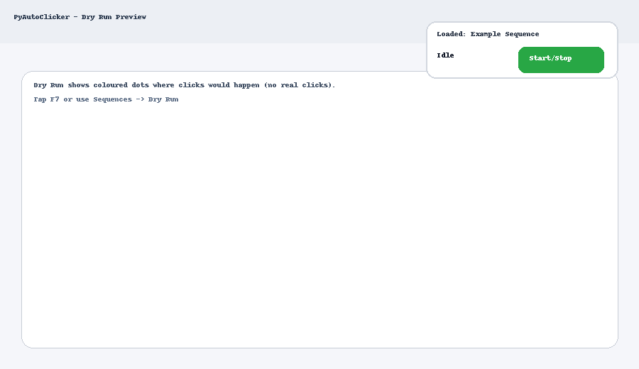

# PyAutoClicker


**Version:** v1.3 · **OS:** Windows · **License:** GPL-3.0

A safe, open Python auto-clicker with a draggable floating status bubble, intuitive recorder (hold **CTRL** & click), a searchable **Sequences Manager**, and a **Dry Run (Preview)** mode that shows *coloured dots* where clicks **would** happen — no clicks are sent.

---

## ✨ Highlights

- 🫧 **Floating bubble** shows status and loaded profile; drag it anywhere  
  - Button colours: **Green** = Idle, **Red** = Running, **Yellow** = Dry Run
- ⏺️ **Recorder:** *Start Recording* → hold **CTRL** & click to add points → release CTRL to finish
- 💾 **Save** always creates a new file (Name/Site/Slot/Date/Notes + Inter-delay + Repeats)
- 📂 **Sequences Manager:** browse, **search**, load, delete, open folder; per-row **Dry Run**
- 👁️ **Dry Run (Preview):** press **F7** or use Tray/Sequences to visualise clicks with coloured dots
- 🖱️ **Hotkeys:** single keys (X, P, 1), named keys (`<space>`, `<enter>`, arrows), combos (`Ctrl+Alt+S`), F-keys
- 🧰 **System tray:** Start / Pause / **Dry Run** / Recorder / Settings / Exit
- 🎛️ **Settings:** General, Hotkeys, Preview (dot size/duration/numbers/interval), Sequences, Help

> **Dependencies:** `pynput`, `pystray`, `Pillow`

 


---

## 🚀 Install (PowerShell, Windows)

> One-liner (admin not required):
```powershell
irm https://raw.githubusercontent.com/GoblinRules/PyAutoClicker/main/install.ps1 | iex
```

The installer:
- downloads the latest `pyautoclicker.py` + icons,
- ensures **Python 3** is installed (auto-installs if missing),
- creates a local **venv**, installs deps,
- adds **Start Menu** + **Desktop** shortcuts (with icon).

### Update / Uninstall
- **Update:** run `update.ps1` (pulls latest from GitHub + updates deps)  
- **Uninstall:** run `uninstall.ps1` (removes app files + shortcuts)

---

## 🧭 Quick Start

1. Launch **PyAutoClicker** from Start Menu or the Desktop shortcut.  
2. Open **Recorder…** → click **Start Recording**.  
3. **Hold CTRL** and click anywhere you want to add a step. **Release CTRL** to finish.  
4. Click **Save Sequence…**, fill out metadata, set **Inter-click delay (ms)** and **Repeats** (0 = infinite), and save.  
5. Press **F6** to start/stop playback; **F9** to pause/resume.

---

## 🔍 Sequences Manager (Search + per-row Dry Run)

- Open **Settings → Sequences**  
- Use the **Search** box to filter across **Name/Site/Slot/Date/Notes/File**  
- Click **Dry Run** in the last column (or use the **Dry Run selected** button) to preview that sequence  
- Buttons: **Load selected**, **Delete selected**, **Refresh**, **Open folder**

---

## 👁️ Dry Run (Preview)

- Hotkey **F7** by default (configurable under **Settings → Hotkeys**)  
- Shows small coloured dots (with step numbers) where clicks **would** occur — **no clicks are sent**  
- Dot style is configurable under **Settings → Preview**:  
  - **Dot size (px)**, **Dot stay (ms)**, **Show numbers**, **Step delay override (ms)**  
  - Use **-1** to honour the sequence’s own **Inter-click delay**

> Dry Run is also available from the **Tray menu** and from **Sequences** (per-row **Dry Run**).

---

## 🫧 Bubble overlay (status)

- **Green** = Idle  
- **Red** = Running  
- **Yellow** = Dry Run  
- Displays **Loaded: <sequence name>**, and updates continuously  
- Drag anywhere on the bubble to move it

---

## ⌨️ Default Hotkeys

| Action | Default |
|---|---|
| Start / Stop | `F6` |
| Pause / Resume | `F9` |
| Add point (manual) | `F8` |
| Finish recording (manual) | `Ctrl+F8` |
| **Dry Run (preview)** | `F7` |

> Hotkeys accept **single keys** (e.g. `x`, `p`, `1`), **named keys** (`<space>`, `<enter>`, arrows), **combos** (`Ctrl+Alt+S`) and **F-keys**.

---

## ⚙️ Settings

- **General**: Base interval (used if no sequence), random jitter (ms), pixel jitter (px), max CPS cap, double-click, dark mode, auto-open Save dialog after recording
- **Hotkeys**: Change any key combo
- **Preview**: Dry Run dot appearance + optional per-step delay override
- **Sequences**: Manager with search + per-row Dry Run
- **Help**: Cheatsheet and tips

---

## 🐞 Troubleshooting

- **No clicks but status is Running** → if you didn’t load/record a sequence, the clicker will click at the **current cursor** using **Base interval**  
- **Hotkey won’t bind** → ensure it’s valid; try `F-keys`, or combos like `Ctrl+Shift+S`  
- **Antivirus flags a script** → this is a plain Python app; review the source (`pyautoclicker.py`) and install from the official repo

---

## 🧪 Building a portable EXE (optional)

You can package with `pyinstaller` (outside scope of the default installer):
```bash
pyinstaller --noconfirm --onefile --windowed --icon docs/pyautoclicker.ico pyautoclicker.py
```

---

## 📄 License

This project is licensed under the **GNU General Public License v3.0** (GPL-3.0). See [`LICENSE`](../LICENSE) for details.
